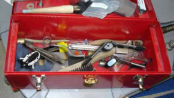

# Tools and Their Uses

Bootstrap 4 template for generating content for US Navy Tools and Their Uses app

## Viewing the files

View files from within a local webserver (XAMPP, MAMP, etc), because this generation template and final framework use AJAX, which will cause same-origin policy violations when viewed locally.

## Content generation process

Process for generating a new chapter html file, with proper markup.

### New chapter html file

Create a blank html file, with the chapter number as the filename

```
2.html
```

### Copy in unformatted text

Copy in text from the Word file into a text editor. Example:

```
Chapter 2
SAFETY AND SAFETY EQUIPMENT
No matter how small the job, safety must be practiced at all times. A tool may be efficient, essential, time-saving or even convenient; but it is also dangerous. When using any hand tool you must use it correctly, following the methods prescribed in this manual. You must also be alert for any conditions that might endanger yourself or fellow workers. Take the time necessary to acquaint yourself with the safety guidelines in this chapter. Remember, you are the most important part of safety procedures.

LEARNING OBJECTIVES
When you have completed this chapter, you will be able to do the following:
1.	State the general safety procedures for common hand tools.
2.	Identify good tool work habits.
3.	List the types of tool boxes.
4.	List the safety precautions that apply to power tools.
5.	Identify the types of personal protective equipment.
```

### Add simple markup
We want to keep the markup as simple as possible, so we'll use simple header tags, paragraph tags, ordered, and unordered lists. Our example becomes:

```
<h1>Chapter 2</h1>
<h2>SAFETY AND SAFETY EQUIPMENT</h3>
<p>No matter how small the job, safety must be practiced at all times. A tool may be efficient, essential, time-saving or even convenient; but it is also dangerous. When using any hand tool you must use it correctly, following the methods prescribed in this manual. You must also be alert for any conditions that might endanger yourself or fellow workers. Take the time necessary to acquaint yourself with the safety guidelines in this chapter. Remember, you are the most important part of safety procedures.</p>

<h3>LEARNING OBJECTIVES</h3>
<p>When you have completed this chapter, you will be able to do the following:</p>
<ol>
	<li>State the general safety procedures for common hand tools.</li>
	<li>Identify good tool work habits.</li>
	<li>List the types of tool boxes.</li>
	<li>List the safety precautions that apply to power tools.</li>
	<li>Identify the types of personal protective equipment.</li>
</ol>
```

### Headings 

Headings will be formatted:
* H1 - chapter number
* H2 - chapter title
* H3 - uppercase headings
* H4 - title case headings immediate children of h3
* h5 - theoretical headings within H4 sections

### Add figures
To keep the markup as simple as possible, we will add figures dynamically, putting only the figure number and caption into markup:

```
<figure data-id="2-1" class="">Improper tool storage</figure>
```

Will output:

```
<figure data-id="2-1" class="">
	
	<figcaption>Figure 2-1 — Improper tool storage</figcaption>
</figure>
```

You can also add bootstrap 4 content classes to the figure, to align or otherwise manipulate:

```
<figure data-id="2-1" class="float-right">Improper tool storage</figure>
```

### Add Alerts
A number of alerts exist in the document, of different styles. Use the bootstrap 4 alert system, with an appropriate class-suffix:

```
<div class="alert alert-note">A note style alert</div>
<div class="alert alert-caution">A caution style alert</div>
```

The titles NOTE or CAUTION, and any accompanying icons, will be added dynamically.

### Column layouts
For columns, use the boostrap 4 grid system, the following will generate a 2x3 layout of figures:

```
<div class="row">
	<div class="col">
		<figure data-id="2-3" class="">Portable tool box</figure>
	</div>
	<div class="col">
		<figure data-id="2-4" class="">Cantilevered tray tool box</figure>
	</div>
</div>
<div class="row">
	<div class="col">
		<figure data-id="2-5" class="">Removable tray tool box</figure>
	</div>
	<div class="col">
		<figure data-id="2-6" class="">Mechanics tool box (chest type)</figure>
	</div>
</div>
<div class="row">
	<div class="col">
		<figure data-id="2-7" class="">Canvas tool bag</figure>
	</div>
	<div class="col">
		<figure data-id="2-8" class="">Five Drawer portable tool box</figure>
	</div>
</div>
```

### Reference

* [Bootstrap 4](https://getbootstrap.com/docs/4.1/getting-started/introduction/) - Bootstrap 4, framework used
